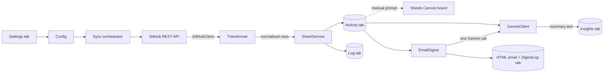

# Architecture

## Goal
Turn GitHub issue/PR activity across N repos into a single, always-current
Google Sheet, with an AI-written summary of what changed, and a Sheets
Canvas board built manually on top.

## Why Apps Script (not Node + GitHub Actions)
See `docs/decisions/0001-use-apps-script-over-node-actions.md`. Short
version: zero hosting, the Sheet is the deployment target anyway, and
free-tier Apps Script triggers are enough for this project's scope.

## Data flow

## Components

| File | Responsibility |
|---|---|
| `src/gas/Config.js` | Reads tracked repos + tab names from the **Settings** tab; reads secrets from PropertiesService |
| `src/lib/GitHubClient.js` | Fetches issues/PRs from the GitHub REST API, handles pagination and rate-limit checks. Takes an injected fetch function so it's testable outside GAS. |
| `src/lib/Transformer.js` | Pure functions: raw GitHub JSON → normalized row objects. No GAS globals. Fully unit tested. |
| `src/gas/Sync.js` | Orchestrator, run under a script lock: loops over configured repos (one repo failing never stops the others), calls GitHubClient → Transformer → SheetService, then — only if something changed — the Gemini summary steps; writes the Insights and Log rows. |
| `src/lib/SheetService.js` | Upserts rows into the Activity tab keyed on `(repo, type, number)` (spreadsheet injected, so it is testable); reports which rows were added or changed. |
| `src/lib/GeminiClient.js` | Calls the Gemini API (`generateContent`) with the change prompt, retries once, and falls back to a second model; returns a short natural-language summary. |
| `src/lib/InsightPrompt.js` | Pure: turns the sync's added/changed rows into the compact prompt text (imported history counted separately from new activity, stale items listed). |
| `src/lib/InsightFormat.js` | Pure: turns the model's `**bold**` markers and `owner/repo#N` references into bold and link ranges; link URLs come only from fetched GitHub data. |
| `src/lib/SyncSummary.js` | Pure: formats a sync's result as the text of the "Sync now" popup. |
| `src/gas/Triggers.js` | Installs the 10-minute sync trigger and the separate daily digest trigger; exposes `manualSyncNow()` for the custom menu (used live on stage instead of waiting on the timer). |
| `src/gas/Menu.js` | `onOpen()` — adds a "Repo Pulse" menu to the Sheet with "Sync now" and "Send digest now" items. |
| `src/gas/EmailDigest.js` | Thin glue for the email digest: reads recipients and the Activity tab, calls the pure digest pieces, sends with `MailApp`, writes the DigestLog row. Run by the menu item and by the daily trigger, under the script lock. |
| `src/lib/EmailDigestBuilder.js` | Pure: `buildDigestHtml(rows, recommendations, meta)` → `{ subject, htmlBody, plainTextBody }`. Inline-styled, table-based HTML in the Kanban palette, with an all-quiet variant. |
| `src/lib/DigestData.js` | Pure: the digest window, which rows are Shipped / In motion / Needs attention, and data-derived recommended actions. |
| `src/lib/DigestPrompt.js` | Pure: the data block sent to Gemini for the digest (one call returns the headline and the actions). |
| `src/lib/DigestRecipients.js` | Pure: parses and validates the rows of the Recipients tab (enabled rows only, valid addresses, de-duplicated). |

## Data model (Google Sheet)

**Settings tab** — one row per tracked repo: `owner | repo | enabled`

**Activity tab** — one row per issue/PR across all tracked repos:
`repo | type (issue/pr) | number | title | state | status label | priority label | assignee | updatedAt | url`

**Log tab** — one row per sync run: `timestamp | reposSynced | rowsUpserted | errors`

**Insights tab** — one row per run: `timestamp | summary (Gemini output)`

**Recipients tab** — who gets the email digest, one address per row: `name | email | enabled`

**DigestLog tab** — one row per digest sent: `timestamp | recipients | subject | trigger (manual/scheduled)`

## Multi-repo support
Not a special case — `Sync.js` just iterates whatever is in the Settings
tab. Adding a third repo to track means adding a row to Settings, not
touching code.

## Security model
Two secrets: `GITHUB_TOKEN`, `GEMINI_API_KEY`. Both live only in Script
Properties (`PropertiesService.getScriptProperties()`), set once via the
Apps Script editor. Never referenced in any committed file.

## Local development
- `clasp pull` / `clasp push` sync `src/` with the Apps Script project
  bound to the Sheet. `rootDir` is `src/`, and `appsscript.json` lives
  inside `src/` (clasp requires this when `rootDir` is set).
- Apps Script's editor displays "/" in file names as pseudo-folders —
  `gas/Config.js` and `lib/GitHubClient.js` show up organized, but every
  file shares one global execution scope. No imports needed between them.
- `src/lib/` is plain JS with dependency injection for GAS globals (e.g.
  `fetchIssues(fetchFn, token, owner, repo)`), so it runs and is testable
  under plain Node (`node --test`).
- `src/gas/` is thin glue code, not unit tested — verified manually by
  pushing and running against the real Sheet.
