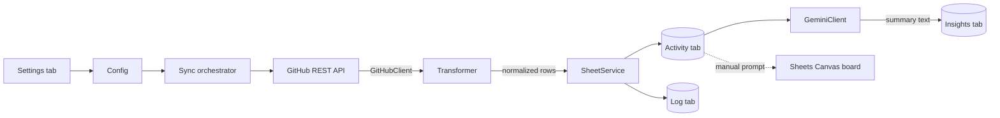

# Architecture

## Goal
Turn GitHub issue/PR activity across N repos into a single, always-current
Google Sheet, with an AI-written summary of what changed, and a Sheets
Canvas board built manually on top.

## Why Apps Script (not Node + GitHub Actions)
See `docs/decisions/0001-use-apps-script-over-node-actions.md`. Short
version: zero hosting, the Sheet is the deployment target anyway, and
free-tier Apps Script triggers are enough for this project's scope.

## Data flow

## Components

| File | Responsibility |
|---|---|
| `src/gas/Config.js` | Reads tracked repos + tab names from the **Settings** tab; reads secrets from PropertiesService |
| `src/lib/GitHubClient.js` | Fetches issues/PRs from the GitHub REST API, handles pagination and rate-limit checks. Takes an injected fetch function so it's testable outside GAS. |
| `src/lib/Transformer.js` | Pure functions: raw GitHub JSON → normalized row objects. No GAS globals. Fully unit tested. |
| `src/gas/Sync.js` | Orchestrator: loops over configured repos, calls GitHubClient → Transformer → SheetService, then GeminiClient once per run. |
| `src/lib/SheetService.js` | Upserts rows into the Activity tab keyed on `(repo, type, number)`; writes a run entry to the Log tab. |
| `src/lib/GeminiClient.js` | Calls the Gemini API with a diff of what changed since the last run; returns a short natural-language summary. |
| `src/gas/Triggers.js` | Installs the time-based trigger; exposes `manualSyncNow()` for the custom menu (used live on stage instead of waiting on the timer). |
| `src/gas/Menu.js` | `onOpen()` — adds a "Repo Pulse" menu to the Sheet with a "Sync now" item. |

## Data model (Google Sheet)

**Settings tab** — one row per tracked repo: `owner | repo | enabled`

**Activity tab** — one row per issue/PR across all tracked repos:
`repo | type (issue/pr) | number | title | state | status label | priority label | assignee | updatedAt | url`

**Log tab** — one row per sync run: `timestamp | reposSynced | rowsUpserted | errors`

**Insights tab** — one row per run: `timestamp | summary (Gemini output)`

## Multi-repo support
Not a special case — `Sync.js` just iterates whatever is in the Settings
tab. Adding a third repo to track means adding a row to Settings, not
touching code.

## Security model
Two secrets: `GITHUB_TOKEN`, `GEMINI_API_KEY`. Both live only in Script
Properties (`PropertiesService.getScriptProperties()`), set once via the
Apps Script editor. Never referenced in any committed file.

## Local development
- `clasp pull` / `clasp push` sync `src/` with the Apps Script project
  bound to the Sheet. `rootDir` is `src/`, and `appsscript.json` lives
  inside `src/` (clasp requires this when `rootDir` is set).
- Apps Script's editor displays "/" in file names as pseudo-folders —
  `gas/Config.js` and `lib/GitHubClient.js` show up organized, but every
  file shares one global execution scope. No imports needed between them.
- `src/lib/` is plain JS with dependency injection for GAS globals (e.g.
  `fetchIssues(fetchFn, token, owner, repo)`), so it runs and is testable
  under plain Node (`node --test`).
- `src/gas/` is thin glue code, not unit tested — verified manually by
  pushing and running against the real Sheet.
