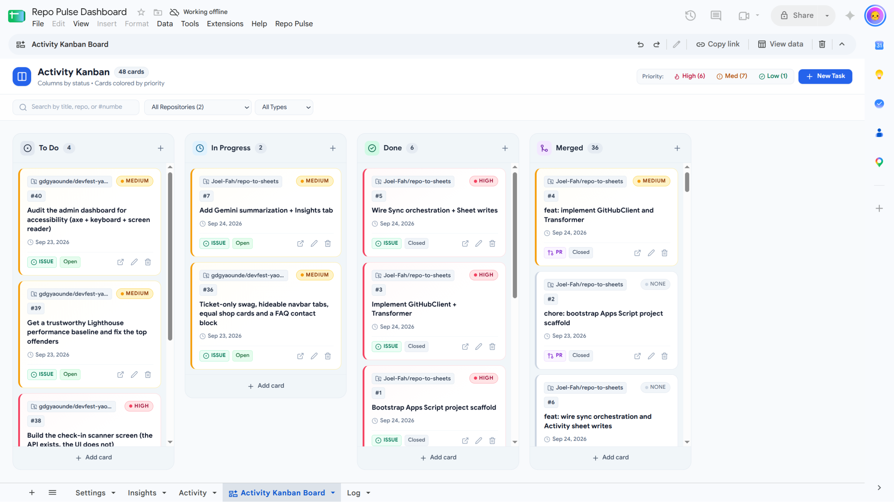

# repo-to-sheets

> Your repo already knows what your team did this week.

A Google Apps Script pipeline that turns GitHub issue/PR activity —
across one or more repos — into a live, self-updating Google Sheet. No
manual status updates. An AI layer (Gemini) summarizes what changed, and
the resulting sheet can be turned into an interactive Kanban board with
zero code using Google Sheets' Canvas feature.

Built as the live demo for a talk at GitHub Dev Days #26, Yaoundé.

## Status
✅ **Demo-ready.** All four build phases are done; the project now tracks
itself, and `gdgyaounde/devfest-yaounde`, live.



*The Sheets Canvas board built on the Activity tab: columns from `status`,
cards colored by `priority`, 48 cards across two repos.*

- ✅ **Phase 1 — Bootstrap:** Apps Script project linked via `clasp`.
  `Repo Pulse → Sync now` and a 10-minute time-based trigger read the
  **Settings** tab + Script Properties and write a run entry to the
  **Log** tab. No GitHub or Gemini calls yet.
- ✅ **Phase 2 — GitHub client & transformer:** issues and PRs are
  fetched (paginated, rate-limit aware) and normalized into Activity rows,
  fully unit tested — see
  [`docs/features/github-client.md`](./docs/features/github-client.md).
- ✅ **Phase 3 — Sheet service & sync orchestration:** every repo in
  Settings is fetched and upserted into the **Activity** tab (keyed on
  `(repo, type, number)`, no duplicates on re-runs), each run is logged, and
  one repo failing never stops the rest. See
  [`docs/features/sheet-service.md`](./docs/features/sheet-service.md).
- ✅ **Phase 4 — Gemini summarization & demo polish:** when a sync finds a
  change, Gemini writes a 2–4 sentence summary into the **Insights** tab, with
  key facts in bold and issue/PR references as links to the real items. A
  second model is tried if the first is overloaded. See
  [`docs/features/gemini-insights.md`](./docs/features/gemini-insights.md) and
  [`docs/features/canvas-board.md`](./docs/features/canvas-board.md).
- 🚧 **Phase 5 — HTML email digest** (built and unit tested; real-inbox check pending): a designed daily (or on-demand) email of what shipped, what is in
  motion and what needs attention, with recommended actions derived from the data, priority chips in the
  Kanban palette, and an "all quiet" version. **Repo Pulse → Send digest now** sends it on demand; recipients
  live in their own Recipients tab. See [`docs/features/email-digest.md`](./docs/features/email-digest.md).

## How it works
See [`ARCHITECTURE.md`](./ARCHITECTURE.md) for the full data flow. Short
version:

```
GitHub API → Apps Script → Google Sheet → Gemini summary → Sheets Canvas board
```

## Quickstart (for contributors)
See [`SETUP.md`](./SETUP.md) for the one-time setup checklist — it
splits out exactly what you need to do yourself in a browser (creating
the Sheet, `clasp login`, setting secrets, Google's one-time
authorization screen) versus what can be handed to Claude Code in a
terminal (writing code, `clasp push`, git/PR workflow). Claude Code has
no access to your Google account, so the browser steps can't be
automated.

## Email digest
List who gets it in the **Recipients** tab (`name | email | enabled`, one address per row, `enabled` = `TRUE`), then use
**Repo Pulse → Send digest now**, or run `installDigestTrigger()` once from the Apps Script editor for a daily send.
Details, design and limits: [`docs/features/email-digest.md`](./docs/features/email-digest.md).

## Tracked repos
Configured in the Sheet's **Settings** tab — no code changes needed to
add or remove a repo.

Two things worth knowing:
- **Insights only update when something changed.** A sync that finds nothing
  new adds no summary, so for a live demo make a change on GitHub first
  (relabel or close an issue), then use **Repo Pulse → Sync now**.
- **If a repo is moved or renamed,** pointing Settings at the new name adds
  its items again under that name; delete the old-name rows from the Activity
  tab by hand (see [`docs/features/sheet-service.md`](./docs/features/sheet-service.md)).

## How this was built
The project was built in five phases, each a tracked issue and PR in this
repo, driven by written instructions that also served as the scope boundary
for each step:

| Phase | Instructions | What it added |
|---|---|---|
| 1 | [`PHASE1_INSTRUCTIONS.md`](./PHASE1_INSTRUCTIONS.md) | Bootstrap, menu, trigger, Log tab |
| 2 | [`PHASE2_INSTRUCTIONS.md`](./PHASE2_INSTRUCTIONS.md) | GitHub client + transformer |
| 3 | [`PHASE3_INSTRUCTIONS.md`](./PHASE3_INSTRUCTIONS.md) | Activity upserts + sync orchestration |
| 4 | [`PHASE4_INSTRUCTIONS.md`](./PHASE4_INSTRUCTIONS.md) | Gemini summaries, Insights tab, demo polish |
| 5 | [`PHASE5_INSTRUCTIONS.md`](./PHASE5_INSTRUCTIONS.md) | HTML email digest |

[`KICKOFF_PROMPT.md`](./KICKOFF_PROMPT.md) is the prompt that started the
build. Architectural decisions are recorded as ADRs in
[`docs/decisions/`](./docs/decisions/):
[0001 — Apps Script over Node + Actions](./docs/decisions/0001-use-apps-script-over-node-actions.md),
[0002 — Gemini summaries: API choice, model fallback, data-only links](./docs/decisions/0002-gemini-summaries-fallback-and-data-only-links.md),
[0003 — Send the digest with MailApp](./docs/decisions/0003-send-the-digest-with-mailapp.md).
Each shipped feature has a page under [`docs/features/`](./docs/features/).

Manual checks against the real Sheet surfaced things the unit tests could
not: a formula-injection hole in text written to Sheets (in plain and in
rich-text cells), lowercase response-header names in Apps Script, and a repo
move that duplicated rows. Each is documented next to the feature it affected.

## Contributing
See [`CONTRIBUTING.md`](./CONTRIBUTING.md). This project tracks its own
activity — every change goes through an issue + PR, labeled per
[`docs/guidelines/labeling-conventions.md`](./docs/guidelines/labeling-conventions.md).

## License
MIT — see [`LICENSE`](./LICENSE).
