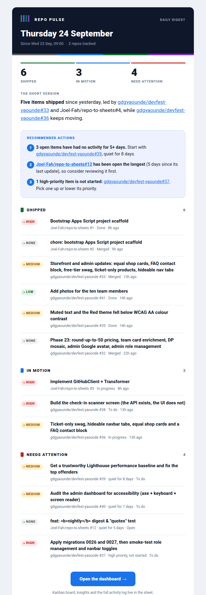
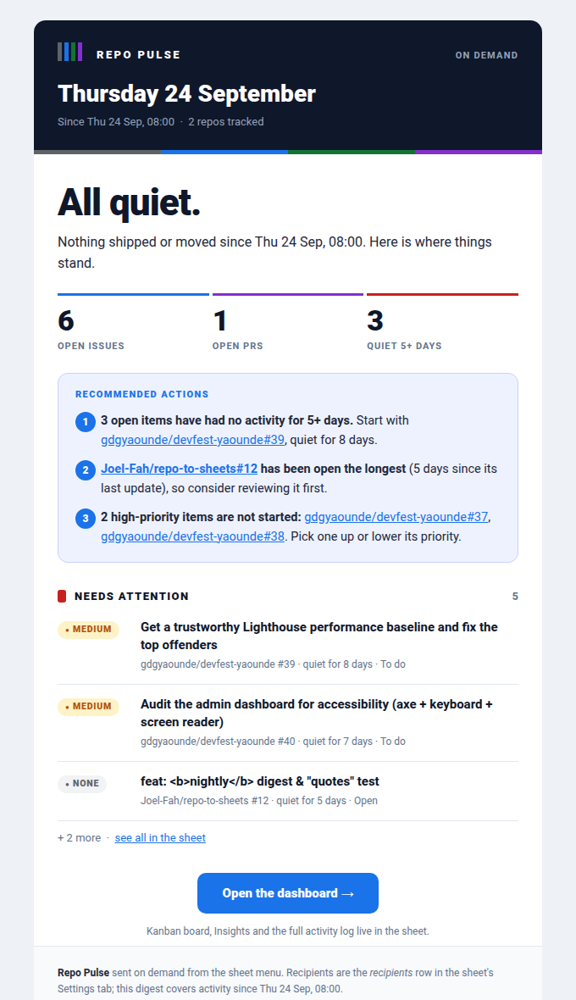

# Email digest

A designed HTML email of repo activity, sent on a daily schedule or on demand from
**Repo Pulse → Send digest now**. It groups what happened, surfaces 2–4 recommended
actions derived from the data, and links back to the sheet.

Files: `src/lib/EmailDigestBuilder.js` (the HTML and plain text), `src/lib/DigestData.js`
(which rows go where, the time window, data-derived actions), `src/lib/DigestPrompt.js`,
`src/lib/DigestRecipients.js`, `src/lib/GeminiClient.js` (`generateDigestInsights`), and the
glue in `src/gas/EmailDigest.js`, `Menu.js`, `Triggers.js`. Decision record:
[ADR 0003](../decisions/0003-send-the-digest-with-mailapp.md).

## What it looks like

*A preview of the HTML rendered in headless Chrome from test data (real fixture rows plus a
few synthetic ones), not a screenshot of a real email client. Real clients differ in small ways.*

- **Header strip:** dark brand bar with a small logo built from the four Kanban column colors,
  the date, the window ("Since Wed 23 Sep, 09:00") and the number of tracked repos, and a
  Daily digest / On demand label. A thin four-color bar sits under it.
- **Stats row:** Shipped, In motion, Need attention, as big numbers.
- **The short version:** one or two sentences from Gemini, with bold facts and linked items.
- **Recommended actions:** a tinted box of numbered actions.
- **Grouped sections:** Shipped, In motion, Needs attention. Each item has a priority chip in the
  Kanban board's palette (High red, Medium amber, Low green, none grey), a linked title, and a
  grey line with repo, number, status and age.
- **Call to action:** an "Open the dashboard" button to the sheet, then a footer.

Sections are capped at 6 items with "+ N more, see all in the sheet".

### The all-quiet email

When nothing shipped and nothing moved in the window, the digest is short but complete: an
"All quiet." hero, a snapshot (open issues, open PRs, items quiet for 5+ days), any items that
still need attention (at most 3), the recommended actions, and the button. It makes no Gemini call.

## What goes in each section

The Activity tab has no "created" date (and its columns are fixed), so sections are based on
`updatedAt` and state, and are named for what they can honestly say:

| Section | Rule |
|---|---|
| Shipped | merged PRs and closed issues updated in the window |
| In motion | open items updated in the window |
| Needs attention | open items untouched for 5+ days (oldest first), then high-priority items still `todo`; never repeats an item already in "In motion" |

## The window

The digest covers activity **since the last scheduled digest** (from the DigestLog tab),
capped at 7 days, or the last 24 hours if there has never been one. Manual sends do not move
the window, so clicking **Send digest now** repeatedly in a demo keeps showing the same content
instead of an empty email.

## Recommended actions

Derived from the data first (`deriveRecommendations`), for example:

- "3 open items have had no activity for 5+ days. Start with owner/repo#39, quiet for 8 days."
- "owner/repo#12 has been open the longest (5 days since its last update), so consider reviewing it first."
- "1 high-priority item is not started: owner/repo#37."
- "2 open issues have no status label, so they are missing from the board."

Then **one** Gemini call (`generateDigestInsights`) gets those facts plus the sections and
returns JSON `{"summary": ..., "actions": [...]}`: the headline and 2–4 actions in a single
response, with the same retries and model fallback as the Insights summary. If Gemini returns
fewer than 2 usable actions, or is unavailable, the data-derived actions are used, so the section
is never filler. Model text is escaped, `**bold**` becomes bold, and an `owner/repo#N` reference
becomes a link only if that item is in the Activity data; any other link or markup is shown as
plain text. `summarizeActivity` (the Insights summary) is unchanged.

## Recipients: the Settings tab

Add one row to the **Settings** tab, below the repos:

| owner | repo | enabled |
|---|---|---|
| Joel-Fah | repo-to-sheets | TRUE |
| recipients | you@example.com, teammate@example.org | |

Column A is the word `recipients`; column B is the list, separated by commas, semicolons, spaces
or new lines. Leave column C empty (the sync ignores the row because it is not `TRUE`). Entries that
are not valid emails are skipped and reported in the popup; duplicates are removed; at most 20.
With no valid recipients the send stops with a message saying what to add. Editing the cell needs no redeploy.

## Sending, permission and quota

Sent with `MailApp.sendEmail` (HTML body, plain-text alternative, sender name "Repo Pulse") from the
script owner's account. The first send shows a new Google authorization screen for the send-only
scope `script.send_mail`. Apps Script's daily email quota applies. Each send is appended to the
**DigestLog** tab (`timestamp | recipients | subject | trigger`, where trigger is `manual` or `scheduled`).
A run holds the same script lock as the sync, so a click and the daily trigger can't send twice.

## Schedule

Run **`installDigestTrigger()`** once from the Apps Script editor. It installs a daily trigger for
`sendScheduledDigest` in the 08:00 hour (script time zone), separate from the 10-minute sync trigger;
re-running either installer never touches the other. There is no digest per sync.

## HTML approach

Follows `.claude/skills/html-email-digest/SKILL.md`: inline styles only, nested tables for layout,
`bgcolor` attributes alongside background colors for Outlook, ~600px wide and fluid below that, no
images, CSS blocks or JavaScript (chips and the logo are colored cells), and a plain-text alternative.
All GitHub-supplied text is HTML-escaped and only `https` URLs become links.

## Testing

`buildDigestHtml`, the selection logic, the prompt and the recipient parser are pure and unit tested
(`emailDigestBuilder`, `digestData`, `digestPrompt`, `digestRecipients`, plus the Gemini tests),
including real fixture data, the all-quiet case, escaping, and the email-client rules (no `<style>`,
no scripts, balanced tables). The Apps Script glue and how the email looks in real clients are checked
by hand.

## Known limits

- No "New" section: rows carry no created date.
- The digest reads the Activity tab, so it is as fresh as the last sync (every 10 minutes).
- Dark mode is not specially handled; the email asks clients for a light color scheme.
